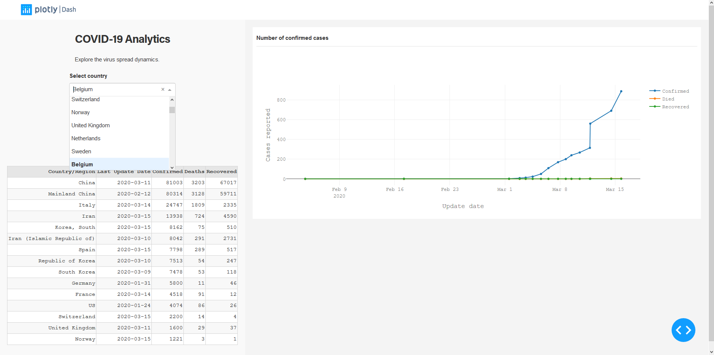

# COVID-19
## Description
Dash dashboard to track the spread of the COVID-19 virus

## Requirements
- python 3

## How to run
```
git clone https://github.com/agalst/covid-19
cd covid-19
python app.py
```

## References
 - The data is from https://github.com/CSSEGISandData/COVID-19
 - The dashboard is based on https://github.com/plotly/dash-sample-apps

## ToDo
 - Add flags to the tables with countries
 - Fix daily aggregations (not the number of reported cases but number of confirmed cases on a given day even if several reports)
 - What to do is different provinces give their info on different dates?
 - What to do if the same countries are named differently? 


## Screenshot
